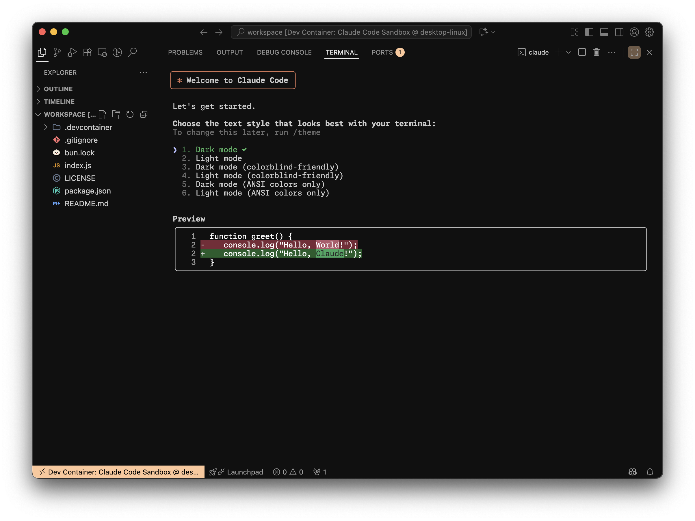

# cc-container

<div align="center">

**A CLI tool to create secure Docker development containers for Claude Code**



_Secure, Isolated, Interactive, Developer-Friendly_

[](https://opensource.org/licenses/MIT)
[](https://nodejs.org/)

</div>

## ⚡ Quick Start

### Required

- [Node.js](https://nodejs.org/) 16+
- [Docker](https://www.docker.com/get-started)
- [VS Code](https://code.visualstudio.com/)
- [Dev Containers Extension](https://marketplace.visualstudio.com/items?itemName=ms-vscode-remote.remote-containers)

## 🎯 Simple Setup

```bash
# Use directly with npx (recommended)
npx cc-container init

# Or install globally
npm install -g cc-container
cc-container init

# Open in VS Code
code .
# Press Ctrl/Cmd + Shift + P → "Dev Containers: Reopen in Container"
```

## 🛠️ Usage

```bash
# Initialize Interactive cli
cc-container init

# Specify output directory
cc-container init --output-dir ./my-project

# Force overwrite existing configuration
cc-container init --force

# Combine flags for fully automated setup
cc-container init -o ./my-project -f
```

## ✨ What You Get

| Feature                   | Description                                                     |
| ------------------------- | --------------------------------------------------------------- |
| **🔒 Secure Container**   | Network restrictions limiting access to essential services only |
| **⚡ Claude Code Ready**  | Pre-installed and configured Claude Code CLI                    |
| **🛠️ Development Tools**  | Git, GitHub CLI, fzf, zsh with powerline10k                     |
| **📦 VS Code Extensions** | Claude Code, ESLint, Prettier, GitLens pre-configured           |
| **🌐 Network Security**   | iptables firewall with domain-based filtering                   |
| **👤 Non-root User**      | Runs securely as `node` user                                    |

## 📝 Changelog

See [CHANGELOG.md](CHANGELOG.md) for detailed release history.

## 📄 License

MIT License - see [LICENSE](LICENSE) file for details.
